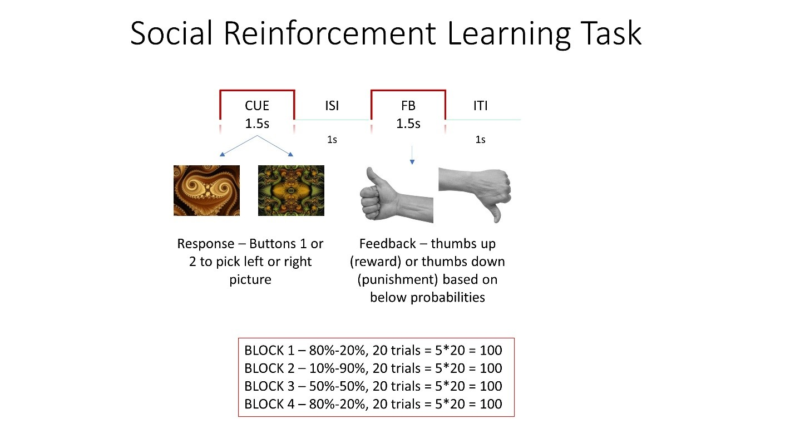

# Task Overview

**Social Reinforcement Learning**: During the task, participants learn to choose one of the two fractal stimuli presented on the screen at a time in order to obtain a reward (cheer sound + thumbs up visual) and avoid punishment (booing sound + thumbs down visual). The associations of the stimuli and outcome change throughout the block and participants have to modify their choice based on their reinforcement history. The probability of associations changes from 80% (picture A)-20% (picture B), 10 (picture A)-90 (picture B),50 (picture A)-50 (picture B), 80 (picture A)-20% (picture B). These associations are pre-defined. We will repeat this task 3 times, so we will use different stimuli each time.

**Paper references**: Kumar et al 2008, Gradin et al 2011 (similar tasks).



# Code Overview

The structure of the code is modular to support separate stimuli on different days of the test.

* The main experiment JavaScript is located in `social-rl-task.js`
* Each day has an `.html` and `.config.js` file associated with it. The only difference between each of the `.html` files is which `.config.js` file is loaded. The `.config.js` files specify the paths to the training and test images for the experiment.
* There is a CSS file for the experiment, `social-rl.css`, defining the visual styles.

**The main experiment code**

The main code in `social-rl-task.js` would be the target for any significant changes to the experiment, beyond just using different stimuli. The code contains _seven_ sections, demarcated by comment headers. I've copied the comment headers here for easy cross-referencing.

`/* define instructions */`

This section creates a series of trials containing the instructions for all phases of the experiment. I used the html-button-response plugin to create these trials so that instructions could be viewed on a mobile device. The main parameters for this plugin are `stimulus`, defining the HTML-formatted content to display, and `choices`, defining the buttons on the screen. In all of these trials only a single button is used, but the label varies depending on where in the instructions sequence we are.

`/* create the affective rating scales */`

This section defines the affective rating scale trials using the html-slider-response plugin. The key parameter here is `labels`, which defines the labels placed on the slider. I also utilized the `data` parameter to tag each trial with the kind of rating being performed.

Because the experiment requires the scales being administered at the start and end of the experiment, I created two copies of the timeline, `ar_start` and `ar_end`. The only difference between these copies is that the `phase` in the `data` parameter indicates which part of the experiment is happening. This should make it easy to write an analysis script to isolate the right part of the data.

`/* create the RL task */`

The first chunk of code in this section creates the three different parts of the RL trial. 

The `fixation_trial` variable defines a simple trial with a fixation cross. Changing the `trial_duration` parameter will change the length of the fixation trial.

The `cue_trial` variable defines the cue display. A couple points worth highlighting here:
* This is an html-button-response trial but uses the `button_html` parameter to render the buttons as images. This allows for images as buttons. 
* The `on_load` parameter adds some additional functionality here to turn the buttons grayscale when the subject makes a choice. The code inside this function runs after the display is loaded for a trial. It adds an event listener to each of the buttons that will turn the button gray through the use of CSS filters if the button is clicked first. The `clicked` variable helps make sure that only one button can be turned gray like this.
* Finally, the `on_finish` parameter does some calculation to add a value to the data called `rewarded` that is `true` if the subject got a reward, `false` if they did not, and `null` if the subject did not respond quickly enough.

The `feedback_trial` variable defines the feedback trial. Duration can be adjusted through the `trial_duration` parameter (currently set to 1,500ms). The stimuli for feedback can be adjusted in the `stimulus` function.

These trials are combined together to form the various blocks of the experiment.

The `practice_block` cycles through the set `[fixation_trial, cue_trial, feedback_trial]`, defined in the `timeline` parameter. The `timeline_variables` parameter is used to create the different kinds of trials shown in this phase. Here there are two possible trials, one where the top image is rewarded and one where the bottom image is rewarded. The `sample` function controls how many trials are shown and in what order. I used a `type: custom` sampling function and wrote a function that runs `total_trials` number of practice trials with proportion of top-image-reward trials set to `p_reward_0`. The `sample` variable generates a random order of trials that matches these parameters.

The `practice_block` also has a conditional timeline that displays a message if participants are too slow on 3 or more of the practice trials. The whole `practice_block` loops if the `loop_function` returns true. The `loop_function` currently checks if the participant responded too slowly on 3 or more trials. Changing *both* instances of `return slow_trials >= 3` to another number allows for control over the number of slow trials allowed in a practice block.

The test trials are defined in `block_1` (there used to be a `block_2` but now there is not; the name stuck). This is similar in structure to the `practice_block`, but without the conditional and looping functions. Here there are 4 possible trials, defined in the `timeline_variables`. When `rewarding_choice` is 0, the top image is rewarding. The order of the `cues` determines which image is on top and which is on the bottom. The fixed trial order is determined by the lengthy array that starts on line 233. Here a `0` corresponds to the first trial listed in `timeline_variables`, a `1` to the second, etc. The order can be changed by modifying this array.


`/* create the picture rating tasks */`

The `picture_select_task` variable creates the trial where subjects indicate which of the two images was rewarding in a specific part of the task. 

The `picture_confidence_task` variable creates the follow-up question, asking the subject how confident they are about their selection in the `picture_select_task`. 

The `picture_rating_procedure` variable defines the timeline that puts these two tasks together. The `timeline_variables` here are used to create the different iterations of this timeline, one for each of the three different phases.


`/* create the final survey */`

The `post_survey` variable creates a timeline of visual analog scale type responses. The questions can be modified by changing the `stimulus`, `labels`, and `data` parameters. These parameters should be self-evident from the code.


`/* data push to server */`

The `save_data` variable creates a function call that **integrates with Test My Brain**. 

The key function is `tmbSubmitToServer()`. This function is created by Test My Brain's JavaScript library. This library is loaded in the `.html` files:

```html
<script type="text/javascript" src="TestMyBrain.12.18.min.js"></script>
```

The script itself is not in the code repository, as the TMB folks can add it to the project when it is uploaded to their server.

The function accepts three kinds of data: `results`, `score`, and `outcomes`.

* `results` is an **array** containing all of the data for the experiment. This array is converted to JSON by the TMB server, and stored as a single JSON string. There is a maximum character length of the string (about 65,000 characters). Thus it may be necessary to not save irrelevant columns of data, like `internal_node_id`. This can be done with `.ignore()`, as shown on line 427.
* `score` is a **number**, representing an overall score for the session. Not used here.
* `outcomes` is an **object** of outcome measures. Not used here.

To integrate other jsPsych experiments with TMB, the same `save_data` variable could be copied into the experiment. You may need to modify the `ignore()` portions of the code to remove/keep relevant/irrelevant variables. Otherwise the same exact code should work.

`/* build the the experiment timeline */`

This is the portion of the code where all of the trials are added to the experiment. Changing the order of the `timeline.push()` statements will change the order of the experiment. Removing trials here, e.g. by commenting them out, will remove them from the experiment.

`jsPsych.init()` must be called to start the experiment. The `preload_images` portion should have a list of all images used in the experiment to ensure that they are loaded at the beginning of the experiment. 

**Please do not use this task without my written consent.**
